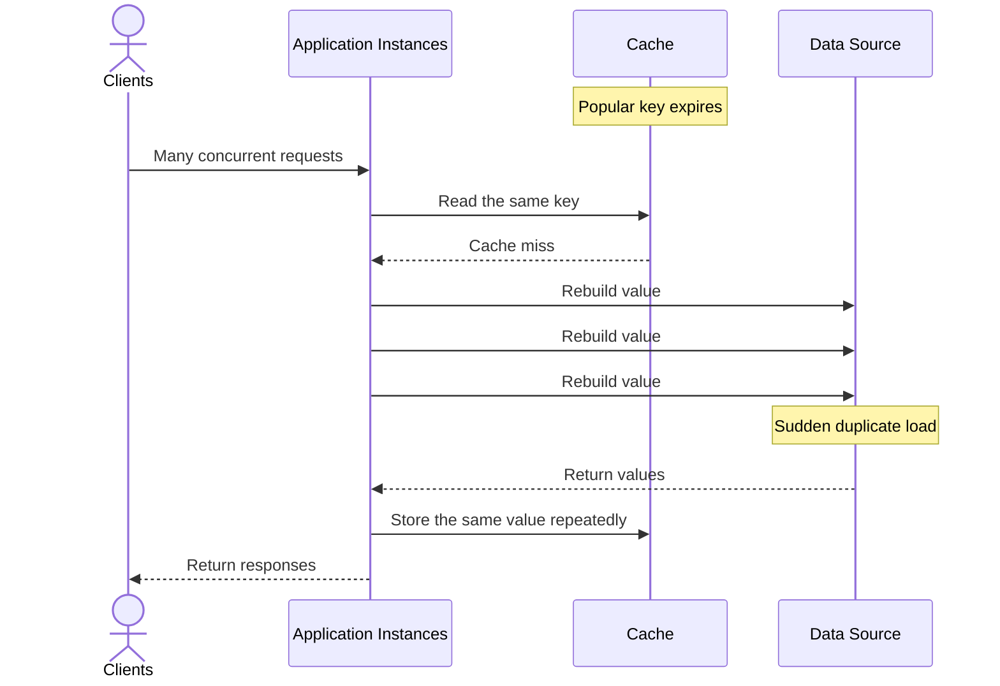
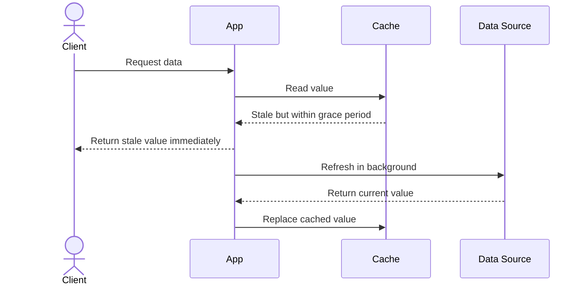
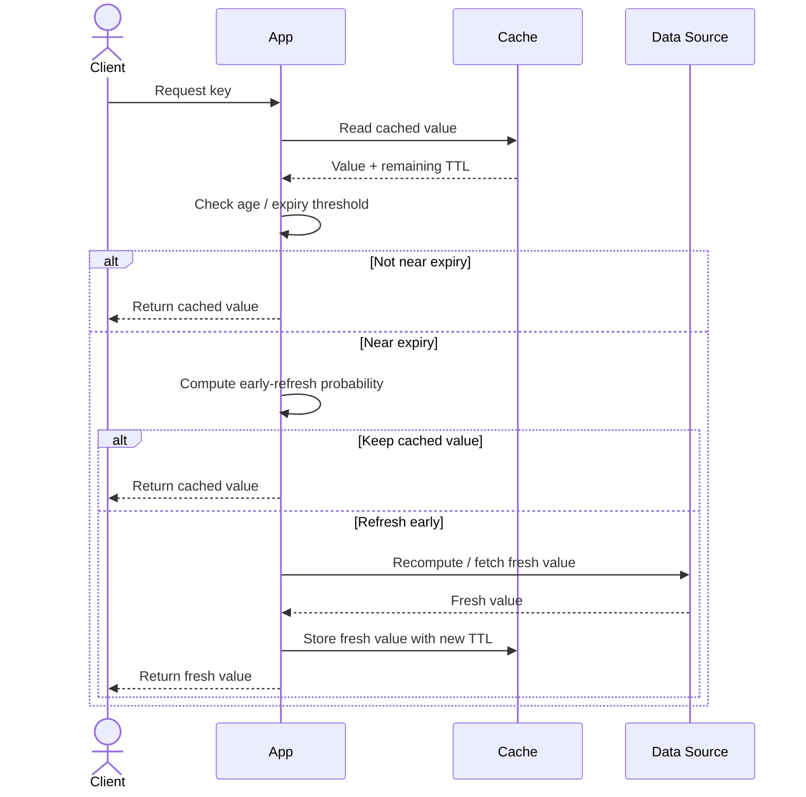

A **[[cache]] stampede** occurs when many requests try to rebuild the same cached value at once. It commonly happens when a popular key expires, is evicted, or is invalidated. It is most visible on high-traffic keys with short TTLs.




# Prevention

## Locking / Request coalescing / Single-flight

Allow only one request to compute a missing value. Other requests wait for that computation and reuse its result.

Example code:

```text
value = cache.get(key)
if value exists:
    return value

if acquire_lock(key, short_timeout):
    try:
        value = cache.get(key)       // check again after acquiring the lock
        if value does not exist:
            value = load_from_source()
            cache.set(key, value, ttl)
        return value
    finally:
        release_lock(key)
else:
    wait briefly, then retry cache.get(key)
```

Use when:

- the key is very expensive to rebuild
- a small number of hot keys gets hammered by many requests
- need to prevent duplicate recomputation as much as possible

Best for:

- user profiles
- product pages
- expensive DB aggregates
- any cache miss that would overload the backend

Tradeoff:

- adds waiting/latency for concurrent requests

Note:

the lock should have a short TTL/timeout so a crashed worker does not block refresh forever.

## Stale-While-Revalidate

The system immediately serves old cached data to users while a background worker asynchronously recomputes fresh data.



Use when:

- serving a slightly old value is acceptable
- need fast responses even during refresh
- freshness matters, but not every request needs the newest data

Best for:

- dashboards
- feeds
- metrics
- content pages where brief staleness is fine

Tradeoff:

- users may see stale data for a short period
### Refresh ahead

See [[caching-strategies]]

Use when:

- can predict popular keys
- want to refresh before users hit expiration
- have a background system already running

Best for:

- highly predictable hot keys
- scheduled reports
- frequently accessed reference data

Tradeoff:

- may refresh unused keys and waste resources

## Add TTL jitter

Add a small random offset to each expiration time so that related keys do not expire simultaneously.

```text
effective_ttl = base_ttl + random(-jitter, +jitter)
```

TTL jitter spreads load over time, but it does not prevent a stampede on one extremely popular key. Combine it with request coalescing or stale-while-revalidate.

Use when:

- many related keys expire at the same time
- need to avoid synchronized expiration bursts

Best for:

- bulk-generated cache entries
- large sets of similar objects
- systems where expiration alignment is causing spikes

Tradeoff:

- helps spread load, but doesn’t fully solve a single hot-key stampede

## Probabilistic Early Expiration

Probabilistic early expiration refreshes a key before its TTL fully ends, but only for some requests and with a random chance.

The chance of early refresh usually increases as the key gets closer to expiry.



**Flow summary:**

- The app reads the cached value and checks how close it is to expiry.
- If it is not near expiry, the cached value is returned.
- If it is near expiry, the app computes a probability of early refresh.
- Some requests still return the cached value.
- Some requests trigger an early refresh and write a new value back to the cache.
- This spreads refreshes over time and reduces stampede risk.

Use when:

- need to smooth refresh load
- can tolerate occasional early recomputation
- need a lighter-weight alternative to strict locking

Best for:

- large-scale caching systems
- traffic patterns where many requests race near expiry
- distributed systems where exact coordination is costly

Tradeoff:

- duplicate refreshes can still happen

## External recomputation

Move the recomputation logic to an external background process that updates the cache periodically or before expiration.  This is best for data that can be precomputed or periodically refreshed.

Use when:

- recomputation is heavy or batchable
- freshness can be managed by a separate worker
- need to keep request path simple

Best for:

- nightly aggregations
- precomputed leaderboards
- derived analytics data

Tradeoff:

- more infrastructure and less on-demand freshness

# Practical rule of thumb

- Need **strong protection** against duplicate work? → **Locking / single-flight**
- Can serve **slightly stale data**? → **Stale-While-Revalidate**
- Have **predictable hot keys**? → **Refresh ahead**
- Many keys expire together? → **TTL jitter**
- Want to **smooth traffic** without strict locking? → **Probabilistic early expiration**
- Recompute can happen outside requests? → **External recomputation**

 It is often safer to combine two protections, such as locking + stale-while-revalidate.
