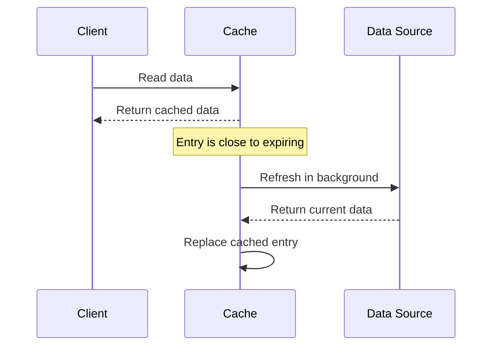
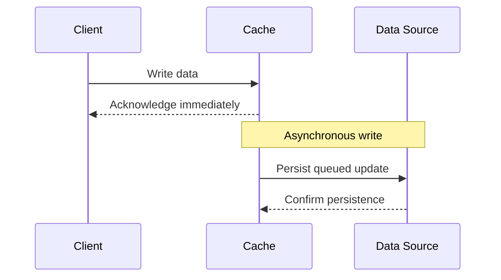
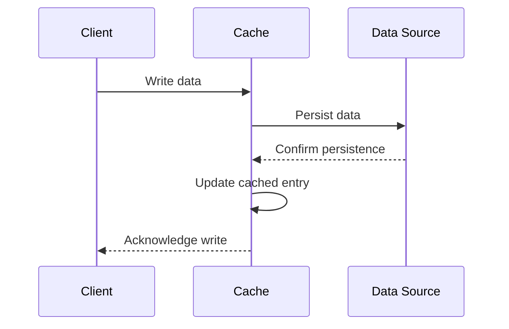
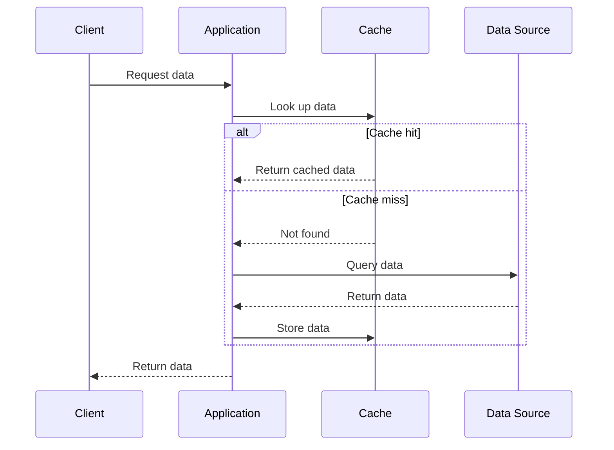

There are several [[cache|caching]] strategies:

- Refresh Ahead
- Write-Behind
- Write-through
- Cache Aside

## Refresh Ahead

**Example:** Product catalog pages, trending news feeds, session metadata, or dashboard widgets.

## Write-Behind

**Example:** Logging, analytics event ingestion, like counters, activity tracking, or telemetry buffers.

## Write-Through

**Example:** User profiles, inventory counts, banking balances, order status.

## Cache Aside

**Example:** User profiles, blog posts, configuration data, search results, or API responses.

