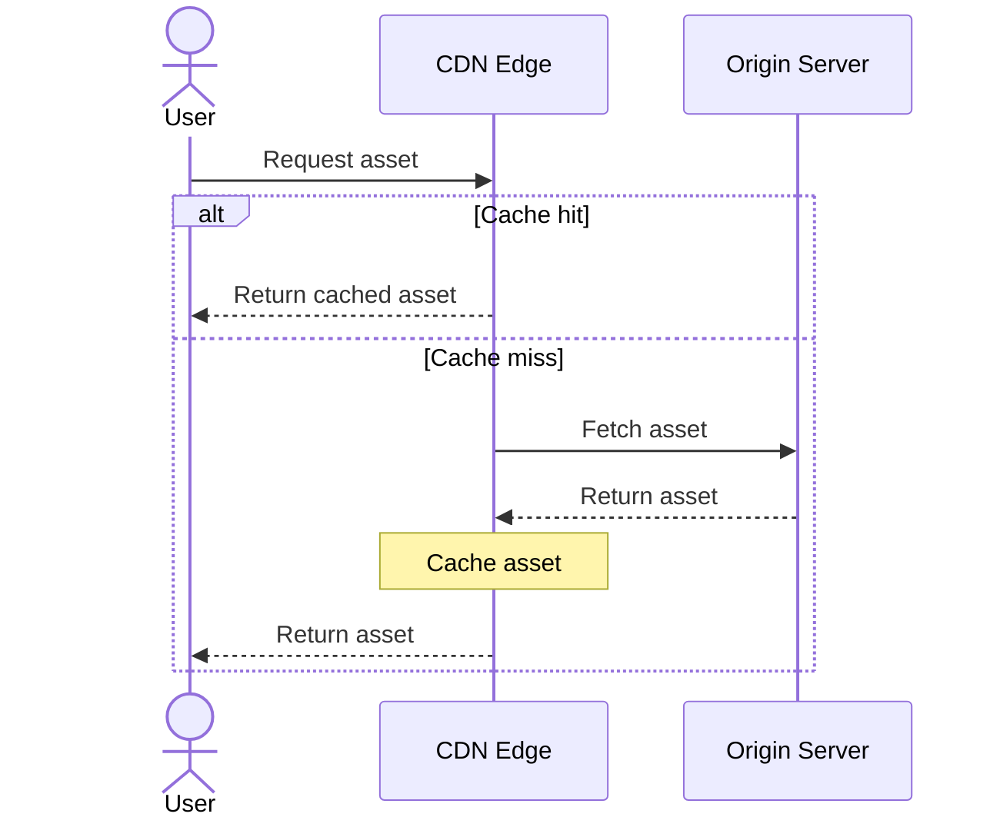
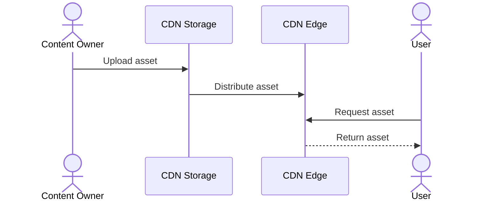

Content Delivery Network (CDN) is a distributed proxy server that [[cache]] website static content closer to users. This routing visitor requests to the nearest **edge server** rather than the main origin server. CDNs can reduce latency and increase page loading speed, and protect websites from traffic spikes and DDoS attacks

## Pull CDN

- **Advantages:** 
	- simple setup
	- automatic distribution
	- storage only for requested content
- **Trade-offs:** 
	- the first request at each edge location is slower and creates origin traffic
	- stale content may require cache invalidation or versioned URLs.
- **Best for:** websites with large or frequently changing content libraries and unpredictable access patterns.

## Push CDN

- **Advantages:** 
	- no cache-miss request to the origin
	- predictable availability
	- direct control over which files and versions are distributed
- **Trade-offs:** 
	- publishing and invalidation must be managed explicitly
	- unused content may consume CDN storage.
- **Best for:** static and versioned assets, large downloads, software releases, and files that must be available immediately at the edge.
## Comparison

| Aspect             | Pull CDN                          | Push CDN                             |
| ------------------ | --------------------------------- | ------------------------------------ |
| Content transfer   | CDN fetches on demand             | Owner uploads in advance             |
| First request      | May be slower due to a cache miss | Served directly from the CDN         |
| Origin dependency  | Needed on cache misses            | Not needed for delivery after upload |
| Content management | Mostly automatic                  | Explicit publishing and removal      |
