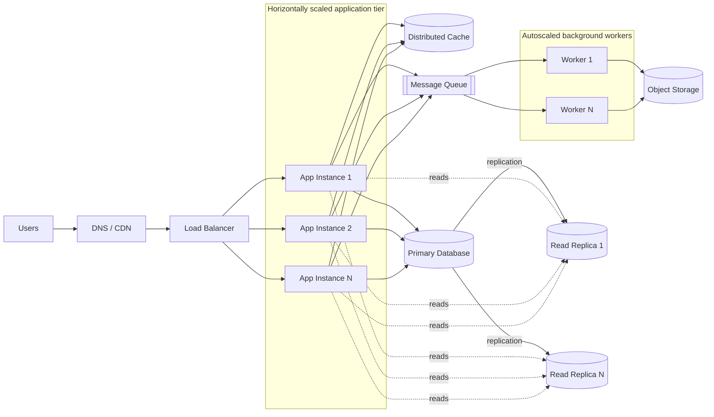

Scalability is a system's ability to handle increasing traffic, data volume, or computation without an unacceptable decline in performance or reliability. A scalable system should grow predictably while keeping latency, error rate, and cost within its targets.

## Vertical Scaling (Scaling Up)

Vertical scaling adds more resources, such as **CPU, RAM, disk capacity, or network bandwidth**, to a single machine.

### Advantages

- **Simple architecture:** The application may not need distributed coordination.
- **Low communication overhead:** Components can communicate through memory or local storage rather than a network.
- **Useful for stateful workloads:** Databases often benefit from a larger machine before they need partitioning.

### Disadvantages

- **Hard physical limits:** A machine can only be upgraded so far.
- **Higher marginal cost:** High-end hardware becomes disproportionately expensive.
- **Single point of failure:** Without replication or failover, one machine can take down the system.
- **Possible downtime:** Some upgrades require restarting or replacing the machine.

## Horizontal Scaling (Scaling Out)

Horizontal scaling adds more machines or service instances and distributes work across them. It is commonly used for large or highly available systems.

### Advantages

- **Incremental growth:** Commodity machines can be added as demand increases.
- **High availability:** Redundant instances allow traffic to continue when a node fails.
- **Elasticity:** Cloud infrastructure can add and remove capacity automatically.
- **Fault isolation:** Failures can be limited to one node, partition, or availability zone.

### Disadvantages

- **Distributed-system complexity:** Network delays, partial failures, retries, consistency, and coordination must be handled explicitly.
- **State management:** Application instances should usually be stateless; sessions and durable data belong in shared stores.
- **Operational overhead:** The system needs load balancing, service discovery, observability, deployment orchestration, and capacity planning.
- **Data challenges:** Databases may require replication, partitioning, or consensus protocols such as **Raft** or **Paxos**.

## Comparison

| Feature                  | Vertical Scaling (Up)                          | Horizontal Scaling (Out)                                 |
| ------------------------ | ---------------------------------------------- | -------------------------------------------------------- |
| Action                   | Add resources to one machine                   | Add more machines to a pool                              |
| Architectural complexity | Lower                                          | Higher                                                   |
| Hardware limit           | Bounded by the largest machine                 | Bounded mainly by architecture and coordination overhead |
| Availability             | Requires separate redundancy                   | Redundancy is built into the approach                    |
| Cost model               | Becomes expensive at the high end              | Grows incrementally, but adds operational cost           |
| Best fit                 | Early-stage systems, monoliths, some databases | High-traffic services and distributed workloads          |

Most real systems use **both** approaches: scale up first for simplicity, then scale out the components that become bottlenecks.

## Example Scalable System Architecture

Traffic is spread across stateless application instances, which can be added or removed independently. The cache absorbs repeated reads, database replicas increase read capacity, and the queue buffers traffic spikes so workers can process jobs at a sustainable rate. The primary database remains a likely write bottleneck and may eventually require vertical scaling, partitioning, or sharding.

## Dimensions of Scalability

Scalability is not only about request volume. A design may need to scale along several dimensions:

- **Traffic:** Requests per second, concurrent users, or open connections.
- **Data:** Stored records, file size, index size, and retention period.
- **Computation:** CPU-intensive jobs, event processing, or machine-learning inference.
- **Geography:** Users across regions who require low latency and regional failover.
- **Organization:** More teams and deployments without creating coordination bottlenecks.

## Common Scaling Techniques

### Application Layer

- Put a **load balancer** in front of multiple stateless application instances.
- Move sessions to a shared cache or database, or use signed client-side tokens where appropriate.
- Run long-running or bursty work asynchronously through a **message queue**.
- Apply timeouts, bounded retries with backoff and jitter, circuit breakers, and idempotency to prevent cascading failures.

### [[cache|Caching]]

- Cache frequently read data at the browser, CDN, application, or database-query layer.
- Choose an eviction policy and time-to-live based on freshness requirements.
- Plan for cache invalidation, cache stampedes, and cold starts.
- Treat a cache as an optimization unless it is deliberately designed as a durable data store.

### Database Layer

- Add indexes and optimize queries before introducing a more complex architecture.
- Use **read replicas** when reads greatly outnumber writes.
- Use **partitioning or sharding** when one database cannot handle the data or write volume.
- Replicate data for availability, while explicitly choosing consistency and failover behavior.
- Avoid hot partitions by selecting partition keys that distribute traffic evenly.

### Static Content and Geography

- Serve images, scripts, and downloads through a **CDN**.
- Deploy services closer to users when network latency dominates response time.
- Use multiple availability zones or regions only after defining data residency, consistency, and disaster-recovery requirements.

## Autoscaling

Autoscaling adjusts capacity in response to demand. Useful signals include CPU utilization, memory pressure, request rate, queue depth, and tail latency.

- **Reactive scaling** responds after a metric crosses a threshold.
- **Scheduled scaling** prepares for known peaks.
- **Predictive scaling** estimates future demand from historical patterns.

Autoscaling is not instantaneous. Startup time, cooldown periods, minimum capacity, and dependency limits must be considered. Scaling on CPU alone can also be misleading; for example, an I/O-bound service may have low CPU while its latency is already unacceptable.

## Measuring Scalability

Track both average behavior and behavior under stress:

- **Throughput:** Requests or jobs completed per unit of time.
- **Latency:** Especially p95, p99, and maximum latency rather than only the average.
- **Saturation:** CPU, memory, connection pools, threads, queue depth, and disk or network utilization.
- **Errors:** Timeouts, rejected requests, failed jobs, and retry volume.
- **Availability:** Whether the service meets its service-level objective (SLO).
- **Cost efficiency:** Cost per request, user, transaction, or gigabyte processed.

Use load, stress, spike, and soak tests to find the system's capacity limit and observe how it fails. The goal is **graceful degradation**, not merely surviving an idealized benchmark.

## Bottlenecks and Scaling Limits

Adding instances helps only when work can be parallelized. A shared database, global lock, rate-limited dependency, or serialized workflow can remain the bottleneck. According to Amdahl's law, the non-parallelizable portion ultimately limits the benefit of adding workers.

Scaling can also create feedback loops: overloaded services respond slowly, callers retry, traffic increases, and the dependency becomes even more overloaded. Backpressure, admission control, rate limiting, and load shedding protect the system when capacity is exhausted.

## Practical Design Process

1. Define expected traffic, growth, latency, availability, consistency, and budget.
2. Measure the current system and identify the actual bottleneck.
3. Apply the simplest improvement first: query tuning, indexing, caching, batching, or vertical scaling.
4. Remove local state and scale the application tier horizontally.
5. Decouple bursty work with queues and workers.
6. Partition data or split services only when measurements justify the added complexity.
7. Test failure modes, recovery, and behavior beyond normal capacity.

> [!important]
> Scalability, availability, and performance are related but distinct. A fast system is not necessarily scalable, and a scalable system is not necessarily highly available. Each property needs explicit requirements and testing.

## Resource

https://www.geeksforgeeks.org/system-design/what-is-scalability/

